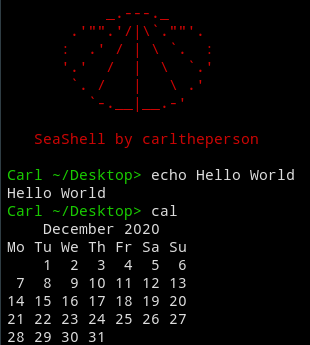
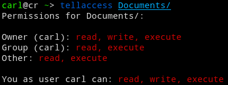
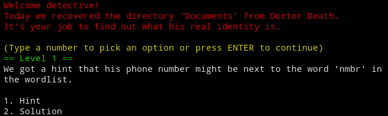
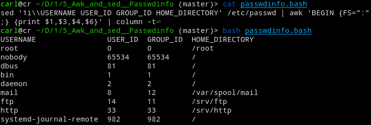
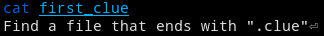
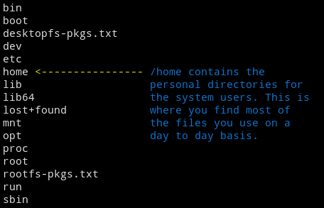
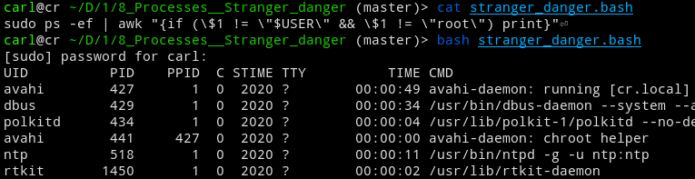
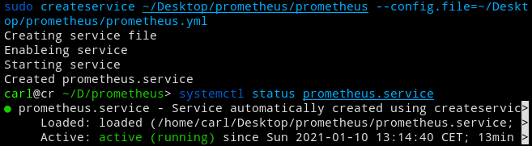
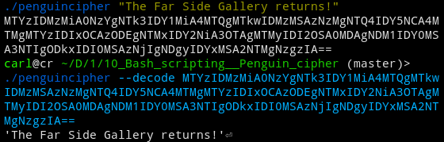

# 10 things Linux

## 1. UNIX - **Recat**

The first thing I wanted to learn more about was UNIX, since Linux is a UNIX-like operating system. I also never really felt that I fully understood what exactly UNIX was, besides being a family of fairly similar operating systems.

The first thing I did was to read the entire Wikipedia page on UNIX. I also read [this](https://people.eecs.berkeley.edu/~brewer/cs262/unix.pdf) original paper written by Dennis Ritchie and Ken Thompson from 1974, which was really interesting though I can’t say I understood all of it. After some more reading and some Youtube videos, I felt comfortable that I understood what UNIX was, and what makes it interesting.
For the project I decided to try and write my first C program. Following the Unix philosophy I made sure that it did one thing only. That thing ended up being a program that reverses the contents of a text file. Since this is just a reverse version of *cat*, I called the program *recat*.

## 2. What is a shell? - **SeaShell**

For this project I was curious to find out what exactly a shell was. Even though it is something that I use often, I was still confused about what differentiates it from the terminal. Turns out it’s really not that complicated. I learned this by rereading the *shell* part of [the paper](https://people.eecs.berkeley.edu/~brewer/cs262/unix.pdf) from the previous project, and some explanations online like [this](https://www.tutorialspoint.com/unix/unix-what-is-shell.htm ) and [this](https://linuxcommand.org/lc3_lts0010.php ). The Unix shell Wikipedia entry was also very informative.

Since this project is about the shell, I found it appropriate to try and write my own. I settled on the name SeaShell, which I found way too funny. It’s not very advanced, but it does the job.

## 3. Ownership and permissions - **Tellaccess**

This is one of the things that I know is really important for Linux, but have never really understood. I have tried before but never been able to get the knowledge to stick, maybe because I didn't really care about security until now. 

The ownership and permission system turned out to be really intuitive, and I was able to understand the basics from [this](https://www.thegeekdiary.com/understanding-basic-file-permissions-and-ownership-in-linux/) one article. I later discovered [this one](https://linuxhandbook.com/linux-file-permissions/) from Linux Handbook which was more comprehensive.

For the project I decided to create a program that tells you in human readable form, the ownership and permissions of a file. I called the project *tellaccess*, because it tells you who can access the file in what ways.

## 4. Grep - **Grep detective**
This is the sort of UNIX magic I have always wanted to learn. Since grep is all about regular expressions I would have to learn that first. This was actually quite difficult because grep uses the *POSIX Basic Regular Expressions*, which is not that common. The [Wikipedia entry](https://en.wikibooks.org/wiki/Regular_Expressions/POSIX_Basic_Regular_Expressions) was a lifesaver. Besides that, I also used the man page for grep as a reference.

For the project I thought that a fun idea might be to create a detective game. In the game you get a folder full of files, and it’s your job to extract information. I called the game Grep detective.

## 5. Awk and sed - **Passwdinfo**
This is more of the UNIX magic that I have always thought was really cool. Though with awk and sed, I never really understood what they were used for. I often saw answers on Stack Overflow with people using them in crazy one liners, but I always copy pasted them without much thought. Well, time to unravel the mystery.

I primarily used [this](https://www-users.york.ac.uk/~mijp1/teaching/2nd_year_Comp_Lab/guides/grep_awk_sed.pdf) paper to learn about awk and sed. For the project I wanted to create my own one liner that shows information about the users on your system in a clear way. I found just reading the */etc/passwd* a little too messy, so the project *passwdinfo*, displays the most important information in a neat table. I found information about the */etc/passwd* file [here](https://www.cyberciti.biz/faq/understanding-etcpasswd-file-format/).

## 6. Find - **Find treasure hunt**
Another important tool I never really got around to learning. Learning how to use *find* was fairly easy, it was mostly about memorizing the different flags, and the format you set the flags in. I used [this](https://kb.iu.edu/d/admm) as a reference.

For the project I created a treasure hunt where you look for clues in files with different attributes. I first wrote a script that created a bunch of small files and directories as noise. Then a selected few of the files got clues to the whereabouts about the other ones. At the end you find the treasure, which I won’t tell you what is.

## 7. File system - **Root tour**
Ever since I executed my first *ls /* I have wondered what all those directories were for. Time to unveil the mystery. The first thing I did was read [this](https://www.linux.com/training-tutorials/linux-filesystem-explained/) article as it explained each directory in root and provided a nice graph. [This](https://tldp.org/LDP/intro-linux/html/sect_03_01.html) resource was also nice since it had a table which summed up each directory in one or two sentences.

The project ended up being a program that gives you descriptions for directories in your own root folder.

## 8. Processes - **Stranger danger**
Another important element of Linux which I have never gotten around to learning. Like many other subjects I have covered here it turned out to be fairly intuitive. [This](https://www.geeksforgeeks.org/processes-in-linuxunix/) article was really easy to understand. I was contemplating for a while what kind of project I could create, but ultimately came up with a command that prints all processes that don’t belong to you or root. That way, you can keep a close eye on who is creating services. Note, there are many legitimate reasons that other users would run processes on your system, and it rarely means someone has gained access to your computer.

## 9. Systemd services - **Createservice**
Whenever I try to set up a database on a Linux machine I have been confused about how to configure the systemd service. I have also been in situations where I needed to create a service from a binary, but always struggled. The struggle ends now.
As with any new subject, it’s always a good idea to read the Wikipedia page, so that is where I started. Surprisingly, I learned that systemd is a quite controversial piece of software, but I still wanted to learn it and judge it for myself.
For understanding the basics of systemd I read [this](https://www.digitalocean.com/community/tutorials/how-to-use-systemctl-to-manage-systemd-services-and-units) and for understanding how to create a new service I read [this](https://www.tecmint.com/create-new-service-units-in-systemd/).

For the project I made createservice, that allows you to make a systemd service from any executable that will automatically startup on boot. Here I test it out on Prometheus:

## 10. Bash scripting

This is something I have been avoiding for a long time. Partly because I believe that my programming language of choice, Golang, is almost as handy when it comes to scripting, and partly because I think that Bash syntax looks horrible. Can’t knock it till’ you try it, so here I am trying to learn myself bash scripting. 

[This](https://www.howtogeek.com/67469/the-beginners-guide-to-shell-scripting-the-basics/) was a nice introduction, and after finding [this](https://devhints.io/bash) cool cheatsheet I felt comfortable trying to create a project. 

The project ended up being a cipher program I called Penguin cipher after Linux’s mascot. It allows you to encrypt text into something like this: *MTExIDIxMSAzMTMgNDAyIDQ2OCA0NjQgMTU5IDI0MSAyMzAgMzY3IDM3NCA1MjYgMTM3IDIyMiAyOTUgMzYzIDQzNCA0MzUg*

